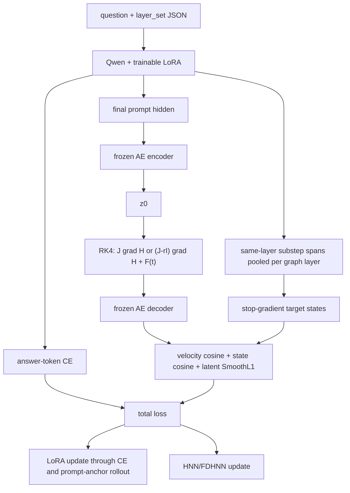

# Framework A gradient and inference boundary

Framework A jointly updates the stage-2 LoRA and one latent Hamiltonian module.
The shared reconstruction AE stays frozen. Direct generation later loads only
base+LoRA; AE/HNN remain training regularizers and analysis artifacts.



The semantic sequence is:

```text
z0 = AE_down(final prompt hidden)
target[k] = mean(contextual hidden tokens from all atomic spans in graph layer k)
z[k+1] = ODESolve(z[k], dt=1/128)
predicted[k] = AE_up(z[k+1])
```

Because `AE_up` is nonlinear, velocity alignment uses
`AE_up(z[k+1]) - AE_up(z[k])`; it never decodes `z[k+1]-z[k]` directly.

| Loss | LoRA | dynamics | AE | Target branch |
| --- | --- | --- | --- | --- |
| token CE | yes | no | frozen | n/a |
| decoded velocity cosine | prompt-anchor path | yes | frozen but differentiable | detached |
| decoded state cosine | prompt-anchor path | yes | frozen but differentiable | detached |
| latent state SmoothL1 | prompt-anchor path | yes | frozen but differentiable | detached |
| structure/force/damping regularization | no | yes | no | n/a |

The stop-gradient is deliberate: the auxiliary objective cannot reduce its loss
by moving both its prediction and target together during one update. Target
values can still drift between optimizer steps because the same LoRA supplies
them; CE constrains that drift and logs/Task 0 must be inspected. A fully frozen
teacher representation would be a stronger but roughly double-forward-cost
future ablation.

The attention mask is constructed from true sequence lengths, not by comparing
token IDs with `pad_id`; this remains correct even if a tokenizer shares PAD and
EOS. The prompt anchor is the token immediately before the first supervised
answer token, and the AE is explicitly trained on that anchor.

Direct inference is greedy `model.generate` from the selected LoRA. It records
finish reason, generated-token count, and JSON/schema validity. A graph-layer
HNN is not advanced per generated token.
