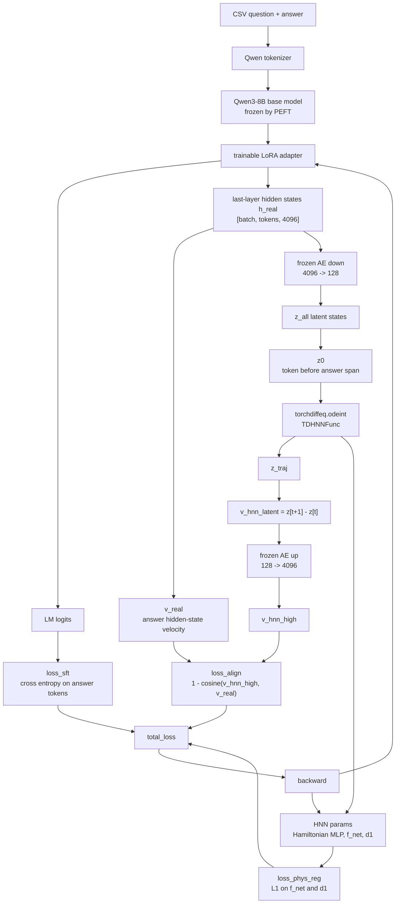
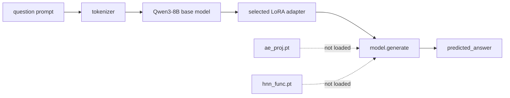

# FrameworkA training and inference boundary

This note records the current implementation in `method/training/framework_a.py`
and `method/inference/pathway.py`.

## Short answer

FrameworkA affects downstream generation only through the LoRA adapter saved by
training. The normal pathway inference script loads:

1. Qwen base model
2. one trained LoRA adapter

It does not load `ae_proj.pt`, does not load `hnn_func.pt`, and does not execute
an HNN rollout at generation time.

## Training network



## Backpropagation chain

The main alignment chain is:

```text
loss_align
  -> cosine_similarity(v_hnn_high, v_real)
  -> v_hnn_high = frozen_AE.up(v_hnn_latent)
  -> v_hnn_latent = z_traj[:, 1:] - z_traj[:, :-1]
  -> z_traj = odeint(TDHNNFunc, z0, t_steps)
  -> TDHNNFunc.forward
  -> H = Hamiltonian MLP(x)
  -> dH/dx through torch.autograd.grad(..., create_graph=True)
  -> qdot/pdot/forcing/damping
  -> HNN parameters
```

The LoRA side of the same alignment loss is:

```text
loss_align
  -> cosine_similarity(v_hnn_high, v_real)
  -> v_real = h_real[answer_t] - h_real[answer_t-1]
  -> h_real = Qwen + trainable LoRA hidden states
  -> LoRA parameters
```

The frozen AE is still differentiable as a fixed mapping. Its parameters have
`requires_grad=False`, so gradients pass through `proj.up(...)` to HNN states,
but AE weights are not updated.

## Parameter update table

| Loss | Updates LoRA | Updates HNN | Updates AE | Notes |
| --- | --- | --- | --- | --- |
| `loss_sft` | yes | no | no | standard answer-token cross entropy |
| `loss_align` | yes | yes | no | alignment graph is intentionally not detached |
| `loss_phys_reg` | no | partially | no | direct L1 regularization on `f_net` and `d1` |

`loss_phys_reg` alone does not train the Hamiltonian MLP. The Hamiltonian MLP is
trained through `loss_align -> odeint -> TDHNNFunc`.

## Current correctness fixes

The maintained FrameworkA script now keeps the alignment graph intact:

```text
v_hnn_latent -> proj.up(v_hnn_latent) -> loss_align
```

There is no `detach()` and no `torch.no_grad()` around this path.

The answer-span start point is also corrected. Padding labels are `-100`, so the
old pattern of counting `labels == -100` can choose a padding token for shorter
batch elements. The current code uses the first answer token and selects the
token immediately before it:

```text
answer_mask = labels != -100
first_answer_idx = answer_mask.argmax(dim=1)
last_p_idx = first_answer_idx - 1
z0 = z_all[:, last_p_idx]
```

The optimizer now also performs a final step when the number of batches is not a
multiple of `gradient_accumulation_steps`.

## Inference boundary

The current generation entry point is `method/inference/pathway.py`.



So the downstream generation result is produced by Qwen + LoRA only. HNN/AE can
be used by downstream evaluators such as Task III PCTE, but they are not in the
normal hypothesis-generation forward pass.
