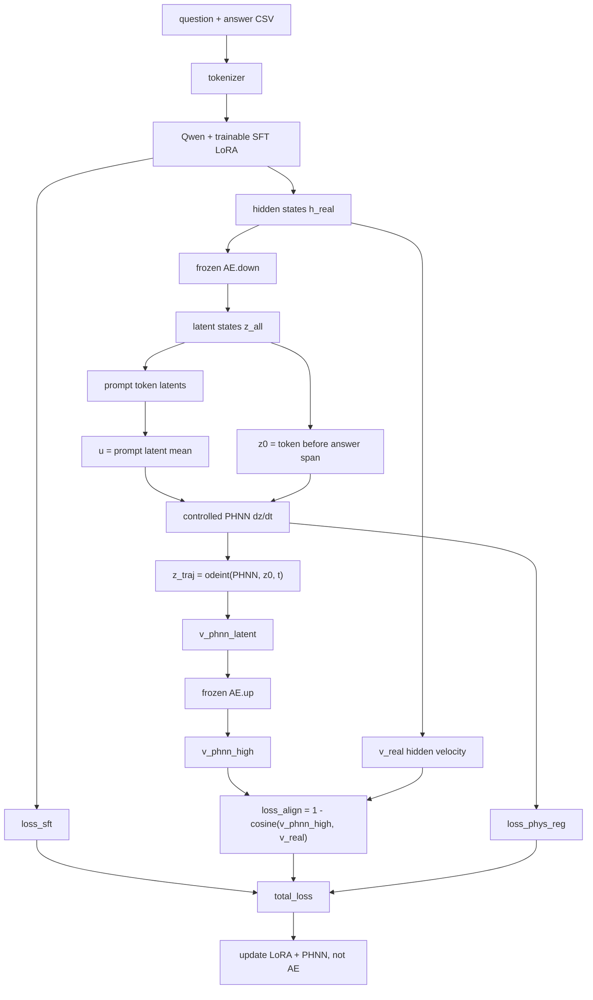

# FrameworkA PHNN training design

This note explains the prototype in `method/training/framework_a_phnn.py`.

## Why add PHNN

The current FrameworkA dynamics module is a forced/damped HNN-style vector field.
It uses a fixed 128-dimensional latent split into 64 dimensions of `q` and 64
dimensions of `p`. That is mechanically convenient, but the split is not learned
from pathway text data.

The PHNN prototype instead uses the full latent state and an explicit control
input:

```text
dz/dt = (J - R) grad_z H(z, u, t) + G u
```

where:

| Symbol | In this code |
| --- | --- |
| `z` | answer-generation latent state from frozen AE down-projection |
| `u` | prompt/context latent control vector |
| `H(z,u,t)` | learned scalar Hamiltonian network |
| `J` | learned skew-symmetric matrix, `raw_J - raw_J.T` |
| `R` | learned positive diagonal damping, `softplus(raw_R_diag)` |
| `G u` | learned linear control drive from prompt context |

## What external input `u` should be

Conceptually, `u` is the external condition that drives the answer trajectory.
For ChatPathway, good candidates are:

| Candidate `u` | Meaning | Data requirement | Status |
| --- | --- | --- | --- |
| prompt latent mean | all question/context text encoded by Qwen and AE | no new columns | implemented now |
| last prompt latent | the final state before answer generation | no new columns | easy ablation |
| species/pathway/phenotype embedding | explicit biological condition | needs reliable columns and encoders | recommended next |
| intervention embedding | KO/drug/perturbation input | needs paired intervention labels | needed for counterfactual tasks |

The implemented first version uses **prompt latent mean**:

```text
prompt text -> Qwen hidden states h_prompt -> frozen AE.down -> z_prompt
u = mean(z_prompt over non-padding prompt tokens)
```

This is intentionally conservative: the existing CSV already contains `question`
and `answer`, so no new data contract is required. The question text usually
contains the pathway, species, phenotype, and requested step context, so its
latent mean is a reasonable first control signal.

## Data format

The current PHNN script uses the same data file contract as FrameworkA:

```text
question, answer, ...
```

Training constructs:

```text
prompt = <|im_start|>user\n{question}<|im_end|>\n<|im_start|>assistant\n
target = {answer}<|im_end|>
```

No separate `u` column is required for the first version.

For a more interpretable second version, add or standardize columns such as:

```text
species, pathway_id, phenotype, condition, intervention
```

Then `u` can be a concatenation or learned fusion of:

```text
u = prompt_latent + species_embedding + pathway_embedding + phenotype_embedding
```

## Training chain



## What gets updated

| Component | Updated? | Why |
| --- | --- | --- |
| Qwen base weights | no | PEFT keeps base frozen |
| LoRA adapter | yes | `loss_sft` and `loss_align` |
| AE projector | no | frozen bridge between hidden and latent spaces |
| PHNN | yes | `loss_align` and structural regularization |

## What this does not change

This file only changes training. It does not make PHNN part of normal
generation. Unless inference is explicitly rewritten, pathway generation remains:

```text
Qwen base + trained LoRA adapter -> model.generate -> predicted_answer
```

The PHNN influence reaches inference only through the LoRA adapter trained under
the PHNN regularization/distillation loss.
