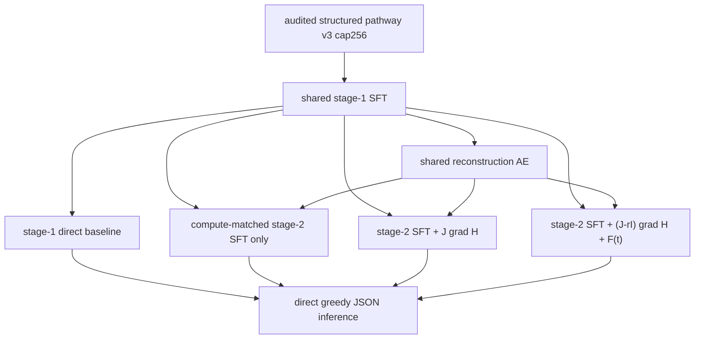

# Training matrix

Each seed has its own `checkpoints/seeds/<seed>` and `runs/seeds/<seed>` tree.
Within that tree, the three stage-2 arms share the same SFT/AE artifacts, data,
seed, epoch schedule, validation grouping, and LoRA optimizer settings.
SFT, AE, and all three stage-2 arms also share the explicit 8192-token budget
and per-process batch size 1; direct inference uses the same prompt budget.
Training exposes one seed/epoch-deterministic prefix per biological record in
each epoch instead of replaying every retained prefix row. Prefix positions
rotate across epochs, with short-continuation emphasis for SFT and
long-continuation emphasis for HNN/FDHNN. Validation uses one seed-fixed,
short/middle/long-balanced prefix per biological record, so checkpoint selection
does not reweight records by their number of eligible prefixes.
Validation is an explicit CSV containing entire held-out `pathway_family_id`
groups and is reused unchanged by SFT, AE, and all stage-2 arms.

The current matrix uses only direct greedy inference. Three generation studies
are retained for the next phase: graph-layer boundary generation using the
current layer-resolution dynamics, token-by-token generation using a separately
trained token-resolution objective, and a multiscale hybrid. Reusing the
graph-layer checkpoint as a per-token vector field is forbidden because it
changes the unit under study. PHNN and Neural ODE remain deferred axes.
