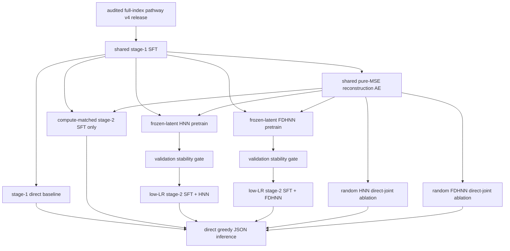

# Training matrix

Each seed has its own `checkpoints/datasets/<dataset_build>/seeds/<seed>` and `runs/datasets/<dataset_build>/seeds/<seed>` tree. The scheduler derives `<dataset_build>` from the immutable dataset manifest rather than the directory label, so two rematerializations cannot share a completion marker.
Within that tree, all stage-2 arms share the same SFT/AE artifacts, data,
seed, validation grouping, and registered low-LoRA-LR settings.
SFT, AE, and all stage-2 arms also share the explicit 8192-token budget
and per-process batch size 1; direct inference uses the same prompt budget.
The formal v4 release exposes one globally balanced, seed-fixed prefix per
biological record. Training and validation reuse that registered view on every
epoch, so record weight cannot change with the number of eligible prefixes.
Epoch-wise prefix rotation remains a separately registered rematerialization
study rather than a hidden source of variation in this matrix.
Validation is an explicit CSV containing entire held-out `pathway_family_id`
groups and is reused unchanged by SFT, AE, and all stage-2 arms.
For stage-1 SFT, length-adjacent global batches reduce DDP stragglers, and the
validation set is sharded without duplication across all four A100s before its
token-weighted loss is reduced. A 48-hour manifest-derived launch gate prevents
an oversized release from starting accidentally.

The current matrix uses only direct greedy inference. Generation studies
retained for the next phase are event-boundary rollout with layer-dependent
step size, graph-layer-only rollout, token-by-token generation using a separately
trained token-resolution objective, and a multiscale hybrid. Reusing the
event/layer checkpoint as a per-token vector field is forbidden because it
changes the unit under study. PHNN and Neural ODE remain deferred axes.
