# Training matrix

This document explains the runnable experiment matrix in `experiments/matrix.json`
and the spreadsheet-style export in `experiments/EXPERIMENT_MATRIX.csv`.

## Layer prefix rule

| Prefix | Layer | Meaning |
| --- | --- | --- |
| `a` | Adapter/direct-generation training | Produces LoRA adapters used by direct Qwen generation. |
| `b` | Shared representation and latent-dynamics teachers | Freezes Qwen/SFT and usually AE, then trains probes or latent dynamics teachers. |
| `c` | Rollout-assisted inference | Uses a trained dynamics teacher at inference time. |
| `d` | Dynamics-to-LoRA training | Distills or jointly regularizes dynamics back into a LoRA adapter. |
| `e` | Downstream transfer/application | Uses the pathway model for a downstream application, currently C2S/Task VI. |

## Shared storage

Runtime paths are interpreted under `CHATPATHWAY_ASSET_ROOT`.

Default:

```bash
export CHATPATHWAY_ASSET_ROOT=/root/autodl-tmp
```

New server example:

```bash
export CHATPATHWAY_ASSET_ROOT=/data/chatpathway
```

Expected subdirectories:

| Relative path | Contents |
| --- | --- |
| `models/` | Qwen base model and external baselines such as Gemma C2S. |
| `data/` | Pathway CSVs, KEGG/reference data, C2S JSONL/H5AD inputs. |
| `checkpoints/` | SFT LoRA, AE, HNN/PHNN, latent teachers, distilled/joint adapters. |
| `runs/` | Inference outputs, downstream task outputs, logs, command plans. |
| `artifacts/` | Optional benchmark reports, figures, and exported bundles. |

## Matrix graph

```mermaid
flowchart TD
  base["Qwen base model\nmodels/qwen3_8B"]
  data["Pathway train/test CSV\ndata/train_11_species_dataset.csv\ndata/test_7_species_dataset.csv"]
  c2sdata["C2S data\nCRISPR_GSE264667_Data/*.jsonl"]
  sft["Shared SFT LoRA\na00 / a01\ncheckpoints/qwen3_8b_sft*"]
  ae["Shared AE projector\ncheckpoints/legacy/qwen3_8b_ae_latent_128_cos/ae_epoch_5/ae_proj.pt"]
  legacy_sft["Legacy SFT adapter\ncheckpoints/legacy/qwen3_8b_sft/checkpoint_epoch_5"]
  legacy_fw["Legacy best FrameworkA adapter\ncheckpoints/legacy/qwen3_8b_FrameworkA_1/checkpoint_epoch_4"]

  base --> sft
  data --> sft
  legacy_sft --> ae
  data --> ae

  sft --> direct["Direct generation baseline\na00/a01 -> runs/inference/sft*"]
  legacy_sft --> hnn["FrameworkA HNN regularized LoRA\na02 -> checkpoints/qwen3_8b_FrameworkA_ae_cos"]
  ae --> hnn
  hnn --> hnn_gen["Direct generation\na02 -> runs/inference/frameworka_ae_cos"]

  legacy_sft --> phnn["FrameworkA PHNN prompt-control LoRA\na03 -> checkpoints/qwen3_8b_FrameworkA_phnn_ae_cos"]
  ae --> phnn
  phnn --> phnn_gen["Direct generation\na03 -> runs/inference/frameworka_phnn"]

  legacy_sft --> lejepa["LeJEPA latent sentence probe\nb00 -> checkpoints/pathway_lejepa_sentence"]
  lejepa --> lejepa_score["Latent prediction scores\nruns/lejepa_pathway"]

  legacy_sft --> teachers["Latent dynamics teachers\nb01 Neural ODE\nb02 gradient flow\nb03 Koopman\nb04 GENERIC\nb05 SINDy\nb06 Latent ODE"]
  ae --> teachers
  teachers --> teacher_scores["Rollout scoring\nruns/latent_dynamics_rollout"]

  teachers --> rerank["Rollout reranking\nc00 -> runs/latent_dynamics_rerank"]
  teachers --> inject["Rollout residual injection\nc01 -> runs/latent_dynamics_injection"]
  teachers --> distill["Teacher-to-LoRA distillation\nd00 -> checkpoints/dynamics_distilled_lora"]

  legacy_sft --> joint["Joint LoRA + dynamics\nd01 Neural ODE\nd02 gradient flow"]
  ae --> joint
  joint --> joint_gen["Direct generation\nruns/inference/joint_lora_dynamics"]
  distill --> distill_gen["Direct generation\nruns/inference/dynamics_distilled_lora"]

  legacy_fw --> c2s["Qwen C2S transfer\ne00 -> checkpoints/qwen3_8b_pathway_c2s_sft_small_5percent"]
  c2sdata --> c2s
  c2s --> task6["Task VI outputs\nruns/c2s and runs/downstream/task6"]
```



## Practical reading

Most rows should not retrain SFT from scratch. Rows `b01`-`b06`, `c00`-`c01`,
and `d00` reuse the same SFT adapter and AE projector. The first full benchmark
pass should therefore cache these shared artifacts once, then fan out the
latent dynamics variants.

`c` rows are inference-time experiments. They need a trained teacher from `b01`
and an existing generation/candidate file; they do not create a new LoRA unless
their upstream `b` or `d` rows are rerun.

`e00` is not a pathway-generation metric row. It is the C2S transfer/application
row for Task VI and should be evaluated against Gemma C2S and the task-specific
single-cell outputs.
