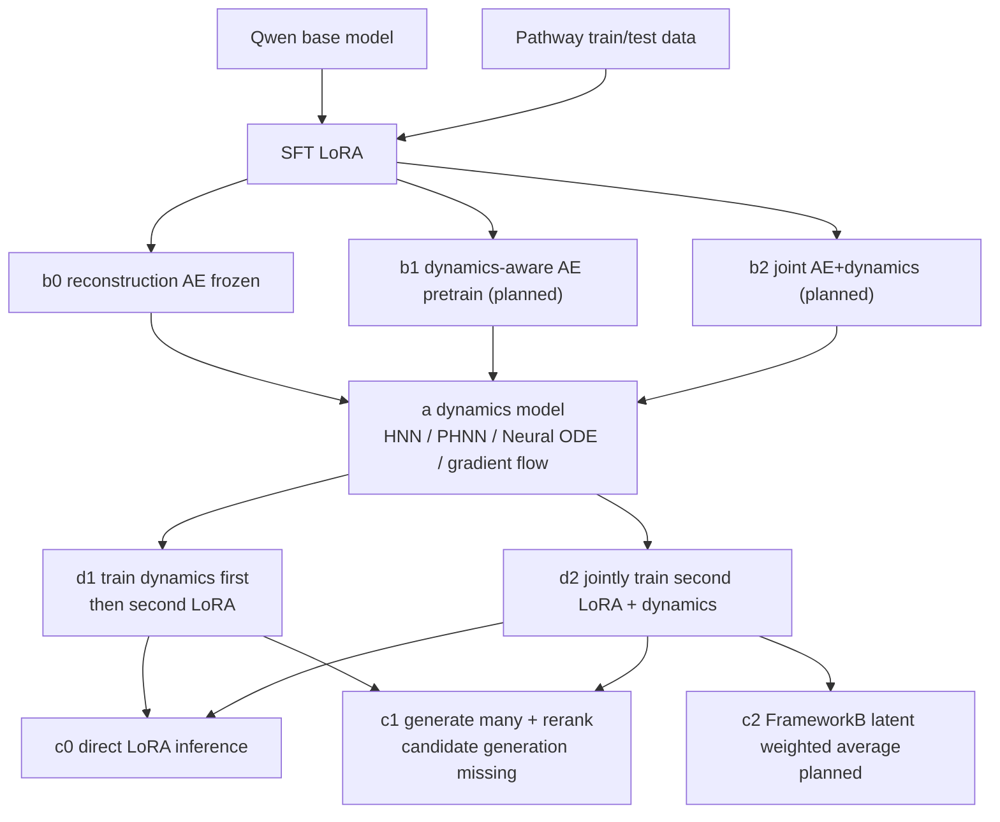

# Training Matrix

`EXPERIMENT_MATRIX.csv` is a layer-combination matrix. The columns are the
experiment; runtime artifacts are not encoded as design columns.

## Axes

| Axis | Current choices |
| --- | --- |
| `a_dynamics` | `none`, `a1_force_damped_hnn_current_control`, `a2_phnn_prompt_control`, `a3_neural_ode_teacher`, `a4_gradient_flow_energy` |
| `b_ae` | `none`, `b0_reconstruction_ae_frozen_current`, `b1_dynamics_aware_ae_pretrain`, `b2_joint_ae_and_dynamics` |
| `d_training_schedule` | `d0_sft_only`, `d1_train_dynamics_then_second_lora`, `d2_joint_second_lora_and_dynamics` |
| `c_inference` | `c0_direct_lora`, `c1_multi_answer_rerank`, `c2_frameworkb_latent_weighted_average` |

## Graph



## Current Main Pipeline

`exp001_hnn_reconae_joint_direct` is the current pipeline expressed in the new
matrix:

```text
a_dynamics = a1_force_damped_hnn_current_control
b_ae = b0_reconstruction_ae_frozen_current
d_training_schedule = d2_joint_second_lora_and_dynamics
c_inference = c0_direct_lora
```

Training chain:

```text
SFT LoRA -> reconstruction AE -> joint second LoRA + HNN regularization
```

Inference chain:

```text
Qwen + final LoRA adapter -> direct generation
```

No AE/HNN module is loaded by `c0_direct_lora` inference.

## Needed Planned Rows

The matrix explicitly keeps these as planned rather than pretending they are
implemented:

| ID | Missing method work |
| --- | --- |
| `plan001_hnn_reconae_teacher_direct` | standalone HNN teacher training plus teacher-to-LoRA distillation |
| `plan002_phnn_reconae_teacher_direct` | standalone PHNN teacher training plus distillation |
| `plan003_hnn_dynamicsawareae_joint_direct` | dynamics-aware AE pretraining objective |
| `plan004_hnn_jointae_joint_direct` | joint AE+dynamics training |
| `plan005_hnn_reconae_joint_rerank` | multi-answer candidate generation and HNN-compatible rerank |
| `plan006_hnn_reconae_joint_frameworkb` | FrameworkB latent weighted-average inference |
