# Training matrix

This document explains the runnable experiment matrix in `experiments/matrix.json`
and the spreadsheet-style export in `experiments/EXPERIMENT_MATRIX.csv`.

## Layer prefix rule

| Prefix | Layer | Meaning |
| --- | --- | --- |
| `a` | SFT and non-dynamics adapter baselines | Trains direct Qwen LoRA baselines without an explicit dynamics middle network. |
| `b` | Core latent-space and dynamics model selection | Compares AE usage, HNN/PHNN/ODE-family dynamics, and rollout fit. |
| `c` | Dynamics-aware inference after model selection | Uses a selected trained dynamics teacher at inference time. |
| `d` | Dynamics-to-LoRA training couplings | Tests staged distillation or joint regularization back into a LoRA adapter. |
| `x` | Optional downstream transfer/application | Uses the pathway model for a downstream application, currently C2S/Task VI. |
| `z` | Lowest-priority speculative ideas | Keeps speculative representation ideas out of the core benchmark. |

## Shared storage

Runtime paths are interpreted through `chatpathway.config.json` in the
repository root. The active profile selects the asset root and standard runtime
subdirectories.

Default profile:

```json
"active_profile": "autodl"
```

New server example: set `active_profile` to `cfff`, then set the `cfff`
profile's `asset_root` to `/data/chatpathway`.

Expected subdirectories:

| Relative path | Contents |
| --- | --- |
| `models/` | Qwen base model and external baselines such as Gemma C2S. |
| `data/` | Pathway CSVs, KEGG/reference data, C2S JSONL/H5AD inputs. |
| `checkpoints/` | SFT LoRA, AE, HNN/PHNN, latent teachers, distilled/joint adapters. |
| `runs/` | Inference outputs, downstream task outputs, logs, command plans. |
| `artifacts/` | Optional benchmark reports, figures, and exported bundles. |

## Matrix graph

```mermaid
flowchart TD
  base["Qwen base model\nmodels/qwen3_8B"]
  data["Pathway train/test CSV\ndata/train_11_species_dataset.csv\ndata/test_7_species_dataset.csv"]
  c2sdata["C2S data\nCRISPR_GSE264667_Data/*.jsonl"]
  sft["Shared SFT LoRA\na00 / a01\ncheckpoints/qwen3_8b_sft*"]
  ae["Shared AE projector\ncheckpoints/legacy/qwen3_8b_ae_latent_128_cos/ae_epoch_5/ae_proj.pt"]
  legacy_sft["Legacy SFT adapter\ncheckpoints/legacy/qwen3_8b_sft/checkpoint_epoch_5"]
  legacy_fw["Legacy best FrameworkA adapter\ncheckpoints/legacy/qwen3_8b_FrameworkA_1/checkpoint_epoch_4"]

  base --> sft
  data --> sft
  legacy_sft --> ae
  data --> ae

  sft --> direct["Direct generation baseline\na00/a01 -> runs/inference/sft*"]
  legacy_sft --> hnn["Current forced/damped HNN FrameworkA baseline\nb00 -> checkpoints/qwen3_8b_FrameworkA_ae_cos"]
  ae --> hnn
  hnn --> hnn_gen["Direct generation\nb00 -> runs/inference/frameworka_ae_cos"]

  legacy_sft --> phnn["FrameworkA PHNN prompt-control LoRA\nb01 -> checkpoints/qwen3_8b_FrameworkA_phnn_ae_cos"]
  ae --> phnn
  phnn --> phnn_gen["Direct generation\nb01 -> runs/inference/frameworka_phnn"]

  legacy_sft -. lowest priority .-> lejepa["Speculative LeJEPA latent sentence probe\nz00 -> checkpoints/pathway_lejepa_sentence"]
  lejepa -.-> lejepa_score["Latent prediction scores\nruns/lejepa_pathway"]

  legacy_sft --> teachers["Latent dynamics teachers\nb02 Neural ODE\nb03 gradient flow\nb04 Koopman\nb05 GENERIC\nb06 SINDy\nb07 Latent ODE"]
  ae --> teachers
  teachers --> teacher_scores["Rollout scoring\nruns/latent_dynamics_rollout"]

  teachers --> rerank["Rollout reranking\nc00 -> runs/latent_dynamics_rerank"]
  teachers --> inject["Rollout residual injection\nc01 -> runs/latent_dynamics_injection"]
  teachers --> distill["Teacher-to-LoRA distillation\nd00 -> checkpoints/dynamics_distilled_lora"]

  legacy_sft --> joint["Joint LoRA + dynamics\nd01 Neural ODE\nd02 gradient flow"]
  ae --> joint
  joint --> joint_gen["Direct generation\nruns/inference/joint_lora_dynamics"]
  distill --> distill_gen["Direct generation\nruns/inference/dynamics_distilled_lora"]

  legacy_fw -. optional downstream .-> c2s["Qwen C2S transfer\nx00 -> checkpoints/qwen3_8b_pathway_c2s_sft_small_5percent"]
  c2sdata --> c2s
  c2s --> task6["Task VI outputs\nruns/c2s and runs/downstream/task6"]
```



## Practical reading

Most rows should not retrain SFT from scratch. Rows `b00`-`b07`, `c00`-`c01`,
and `d00`-`d02` reuse the same SFT adapter and usually the same AE projector.
The first full benchmark pass should therefore cache shared SFT and AE artifacts
once, then fan out the core dynamics variants.

`b` rows are the core model-selection layer for current forced/damped HNN, PHNN,
Neural ODE, gradient flow, Koopman, GENERIC, SINDy, and latent ODE candidates.
This is where the AE/dynamics training schedule should be compared.

`c` rows are inference-time experiments. They need a trained teacher from `b02`
and an existing generation/candidate file; they do not create a new LoRA unless
their upstream `b` or `d` rows are rerun.

`x00` is not a pathway-generation metric row. It is the optional C2S
transfer/application row for Task VI and should be evaluated against Gemma C2S
and the task-specific single-cell outputs after the core pathway model choice is
stable.

`z00` is intentionally lowest priority. It is a speculative LeJEPA-style latent
prediction probe, not part of the first dynamics benchmark.
